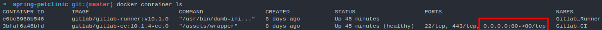

# Gitlab + CI = GitlabCI

## Um poderoso repositório de códigos e Continuous Integration

Todos nós da comunidade de desenvolvedores conhecemos várias plataformas de repositórios e Continuous Integration, cada uma com seus devidos destaques, e boa parte do mercado acaba selecionando uma plataforma para cada um deles (repositório e CI), fazendo com que haja um trabalho a mais para que a integração entre esses 2 estejam completas e bem refinadas para poderem ser utilizadas pelo seus times.

Mas porque não usar uma ferramenta que una esses 2 serviços?

### Montando seu próprio Gitlab CI com Docker

Para criar nosso lab iremos utilizar a última versão disponível, a v10.1. Caso queira  consultar mais infos sobre outras versões do Gitlab, acesse o [repositório oficial](https://hub.docker.com/r/gitlab/gitlab-ce/) do Gitlab no DockerHub.

Agora abra o seu terminal a faça do download da imagem do Gitlab CE (Community Edition)

```docker
docker pull gitlab/gitlab-ce:10.1.4-ce.0  restart: always

```

O download é um pouco demorado. Após a sua conclusão, inicie o download do runner do GitlabCI com o comando abaixo. Veja que iremos utilizar também a versão 10 do Runner, pois se formos utilizar uma versão diferente do Gitlab CE que baixamos, há grande chances de haver incompatibilidades.

```docker
gitlab/gitlab-runner:ubuntu-v10.1.0
```

Feito os download vamos iniciar o processo de criação dos contâiners. Crie uma pasta em algum diretório com o nome GitlabCI e dentro dele crie o arquivo ```docker-compose.yml``` e adicione as informações abaixo. Essa é a receita que irá subir os contâiners, dar um hostname ao Gitlab CI, configurar a network deles e a persistência nos volumes

Caso tenha duvidas sobre o docker compose, sua instalação e utilização, [clique aqui](https://docs.docker.com/compose/install/).

```yaml
version: '3'
services:
 Gitlab_CI:
  container_name: Gitlab_CI
  image: 'gitlab/gitlab-ce:10.1.4-ce.0'
  networks:
   - 'DockerLAN'
  restart: always
  hostname: 'gitlab.docker'
  ports:
   - '80:80'
  volumes:
   - '/srv/gitlab/config:/etc/gitlab'
   - '/srv/gitlab/logs:/var/log/gitlab'
   - '/srv/gitlab/data:/var/opt/gitlab'
 Gitlab_Runner:
  container_name: Gitlab_Runner
  image: 'gitlab/gitlab-runner:v10.1.0'
  networks:
   - 'DockerLAN'
  restart: always
  volumes:
   - '/var/run/docker.sock:/var/run/docker.sock'
   - '/srv/gitlab-runner/config:/etc/gitlab-runner'
networks:
 DockerLAN:
  driver: bridge
```

!

__EXPLICAR OS STEPS DO COMPOSE__ 

!

Concluída a execução, você terá o retorno do compose como OK informando que os contâineres foram criados. Digite ```docker container ls``` e você verá que o contâiner do Gitlab Runner já está rodando e o do Gitlab CI está sendo iniciado ```(health: starting)```, como na imagem abaixo:


Aguarde mais alguns minutos para que todo serviço seja configurado e execute mais uma vez comando do ```ls``` para conferir se o status do contâiner está como ```(healthy)``` (pode demorar em torno de 10 minutos). Quando estiver ```healthy``` abra o seu navegador e digite ```localhost:80```, sendo 80 a porta que foi exposta para acesso. Caso você tenha utilizado outra porta e não lembra qual, no terminal execute o ```docker container ls``` e veja a porta exposta, conforme no destaque da imagem abaixo:



## Primeiro acesso ao Gitlab CE

No seu primeiro acesso ele irá solicitar a nova senha para o usuário "root", digite uma de sua preferência. Logo em seguida ele irá te redirecionar a página de login da plataforma, digite o usuário "root" e a senha que você definiu na página anterior.

Agora que já acessamos nosso Gitlab, precisamos configurar o Gitlab Runner para que possamos começar a fazer oclear upload dos projetos e a brincar com lab. Na parte superior do Gitlab, clique no icone de configuração (exemplo na imagem abaixo)


E na página de configurações, do lado esquerdo, clique na opção "Runners"


Ao acessar a página veja que não temos nenhum Runner configurado, então vamos configura-lo também utilizando os comandos via Docker :)

Abra o terminal e digite:

```docker
docker exec -i -t Gitlab_Runner sudo gitlab-runner register
```

Ele irá apresentar a mensagem abaixo dando inicio a configuração do Runner. O primeiro passo é informar a URL do Gitlab, então digite o hostname do serviço como está descito no exemplo abaixo e aperte Enter:

```terminal
Please enter the gitlab-ci coordinator URL (e.g. https://gitlab.com/):
http://gitlab.docker/
```

O próximo passo é informar o Registration Token. Para copia-lo, vá na página dos Runners no Gitlab e copie a chave disponivel na tela (exemplo abaixo), cole no terminal e pressione enter:


Apos informar o Token, ele irá solicitar a descrição do Runner, digite a sua preferencia, conforme imagem mostra:

```terminal
Please enter the gitlab-ci description for this runner:
[ebce76428bsb]: runner_gitlab
```

Logo em seguida ele irá soliciar a Tag para esse Runner. É um passo muito importante pois é com essa Tag que você irá utilizar nos jobs de suas pipelines para que eles funcionem corretamente. Pode se usar a opção para que elas funcionem sem ela, mas vamos utiliza-la, já que é um processo mais detalhado e de muita importancia se conhecer. Descreva uma Tag fácil de se identificar, veja o exemplo:

```terminal
Please enter the gitlab-ci tags for this runner (comma separated):
runner01
```

Após "_taggear_" o Runner, temos de indicar se ele poderá executar jobs não "_taggeados_" e se vamos travar o Runner apenas em 1 projeto. Vamos configurar para que os jobs sem Tags não sejam executados e deixar o runner compartilhado, assim todos os projetos que tiverem com a Tag ```runner01``` configurada, serão executados.

```terminal
Whether to run untagged build [true/false]
[true]: false
whether to lock the Runner to current projeto [true/false]
[true]: false
```

Assim que essas informações forem adicionadas, o Register irá retornar uma mensagem informando que o registro foi efetuado com sucesso e a ID do Runner criado:

E para concluir o registro, vamos indicar qual executor do Runner iremos utilizar e a imagem padrão a ser utilizada. No caso iremos utilizar o executor Docker e a uma imagem do alpine:3.5. Essa imagem padrão será utilizada caso não seja especificada nenhuma na execução do job na pipeline.

O executor Docker permite que você execute cada job em um contâiner separado e isolado com uma imagem pré-definida em seu ```.gitlab-ci.yml```

```terminal
Please enter the executor: docker-ssh, parallels, kubernetes, docker-ssh+machine, docker, shell, ssh, virtualbox, docker+machine:
docker
Please enter the dafault Docker image (e.g. ruby:2.1):
alpine:3.5
```

_Mais informações sobre os outros executores do Gitlab CI, [clique aqui](https://docs.gitlab.com/runner/executors/README.html)_

Agora retorne ao Gitlab e veja que seu novo Runner está ativo


Mas antes de finalizarmos, temos de fazer mais alguns ajustes dentro do Runner para que ele consiga identificar o Gitlab e fazer o pull dos projetos. Acesse o container do Gitlab Runner com o comando ```docker container exec -t -i Gitlab_Runner /bin/bash``` e navegue até a pasta ```/etc/gitlab-runner```. Nela terá o arquivo ```config.toml```, edite ele conforme a instrução abaixo:

```toml
concurrent = 1
check_interval = 0

[[runners]]
  name = "runner_ubuntu"
  url = "http://gitlab.docker/"
  token = "e2a798aec934eb3c36781c5f8f6c50"
  executor = "docker"
  [runners.docker]
    tls_verify = false
    image = "alpine:3.5"
    privileged = false
    disable_cache = false
    volumes = ["/cache"]
    shm_size = 0
    extra_hosts = ["gitlab.docker:_ip_do_docker_host_"]
  [runners.cache]

```
Observe que no campo ```extra_hosts``` 

Agora que temos o nosso Gitlab CI "de pé" e com o Runner ativo, bora subir um projeto nele e criarmos nossa pipeline.


<!-- Explicar a prática de "taggear" as imagens. -->

<!-- Colocar explicação de cada passo da execução acima. -->