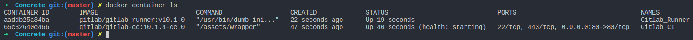
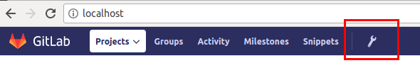
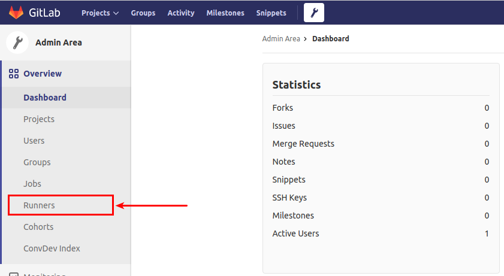
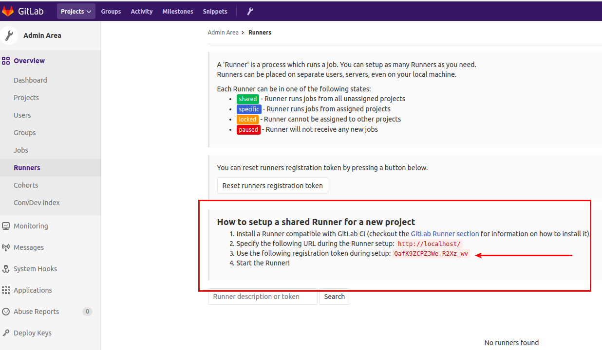
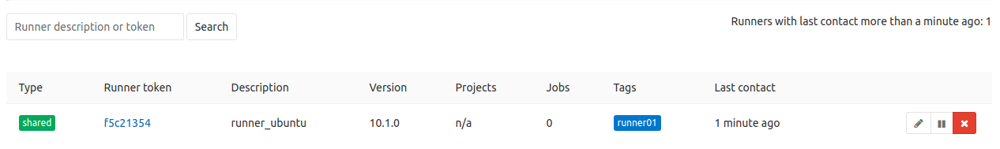
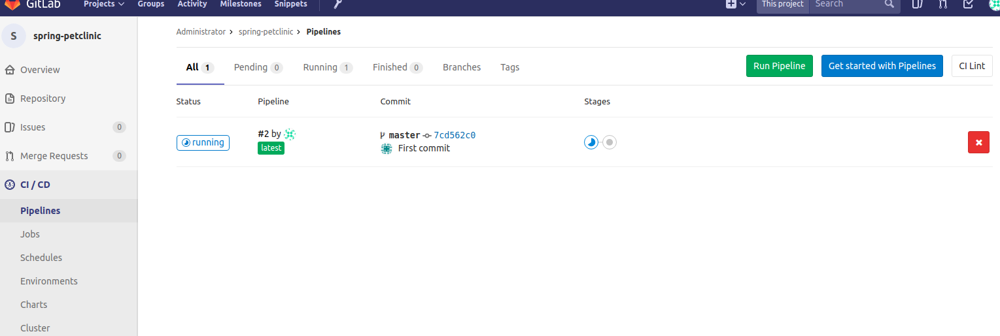
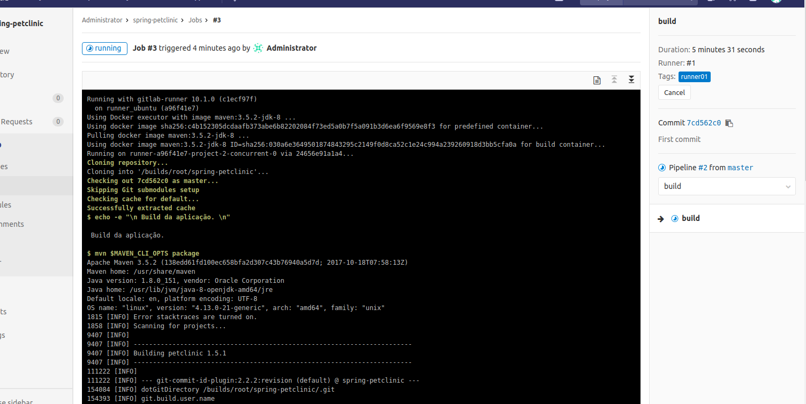

# Gitlab + CI = GitlabCI

## Um poderoso repositório de códigos e Continuous Integration

Todos nós da comunidade de desenvolvedores conhecemos várias plataformas de repositórios e Continuous Integration, cada uma com seus devidos destaques, e boa parte do mercado acaba selecionando uma plataforma para cada um deles (repositório e CI), fazendo com que haja um trabalho a mais para que a integração entre esses 2 estejam completas e bem refinadas para poderem ser utilizadas pelo seus times.

Mas porque não usar uma ferramenta que una esses 2 serviços?

### Montando seu próprio Gitlab CI com Docker

Para criar nosso lab iremos utilizar a última versão disponível, a v10.1. Caso queira  consultar mais infos sobre outras versões do Gitlab, acesse o [repositório oficial](https://hub.docker.com/r/gitlab/gitlab-ce/) do Gitlab no DockerHub.

Agora abra o seu terminal a faça do download da imagem do Gitlab CE (Community Edition)

```terminal
docker pull gitlab/gitlab-ce:10.1.4-ce.0  restart: always
```

O download é um pouco demorado. Após a sua conclusão, inicie o download do runner do GitlabCI com o comando abaixo. Veja que iremos utilizar também a versão 10 do Runner, pois se formos utilizar uma versão diferente do Gitlab CE que baixamos, há grande chances de haver incompatibilidades.

```terminal
docker pull gitlab/gitlab-runner:ubuntu-v10.1.0
```

Feito os download vamos iniciar o processo de criação dos contâiners. Crie uma pasta em algum diretório com o nome GitlabCI e dentro dele crie o arquivo ```docker-compose.yml``` e adicione as informações abaixo e salve o arquivo. Essa é a receita que irá subir os contâiners, dar um hostname ao Gitlab CI, configurar a network deles e a persistência nos volumes

_Caso não tenha o Docker-Compose em sua máquina, sua instalação e utilização estão disponíveis [aqui](https://docs.docker.com/compose/install/) nessa documentação oficial do Docker. E mais informações sobre o quão "bão" é o Compose, você também pode ler [esse post](https://www.concrete.com.br/2017/12/11/docker-compose-o-que-e-para-que-serve-o-que-come/) em nosso blog._

```yaml
version: '3'
services:
 Gitlab_CI:
  container_name: Gitlab_CI
  image: 'gitlab/gitlab-ce:10.1.4-ce.0'
  networks:
   - 'DockerLAN'
  restart: always
  hostname: 'gitlab.docker'
  ports:
   - '80:80'
  volumes:
   - '/srv/gitlab/config:/etc/gitlab'
   - '/srv/gitlab/logs:/var/log/gitlab'
   - '/srv/gitlab/data:/var/opt/gitlab'
 Gitlab_Runner:
  container_name: Gitlab_Runner
  image: 'gitlab/gitlab-runner:v10.1.0'
  networks:
   - 'DockerLAN'
  restart: always
  volumes:
   - '/var/run/docker.sock:/var/run/docker.sock'
   - '/srv/gitlab-runner/config:/etc/gitlab-runner'
networks:
 DockerLAN:
  driver: bridge
```

!

__EXPLICAR OS STEPS DO COMPOSE__ 

!

Agora que temos nosso ```docker-compose.yml``` criado, ainda na pasta do projeto, digit e ```docker-compose up -d``` e você terá o retorno do compose como OK informando que os contâineres foram criados. Digite ```docker container ls``` e você verá que o contâiner do Gitlab Runner já está rodando e o do Gitlab CI está sendo iniciado ```(health: starting)```, como na imagem abaixo:



Aguarde mais alguns minutos para que todo serviço seja configurado e execute mais uma vez comando do `ls` para conferir se o status do contâiner está como `(healthy)` (pode demorar em torno de 10 minutos).

Enquanto o serviço é iniciado, vamos adicionar o host do Gitlab em nosso hosts conhecidos para facilitar o nosso acesso. Abra o terminal e digite o comando do docker para pegarmos o IP do container Gitlab_CI

```docker
docker container inspect --format='{{range .NetworkSettings.Networks}}{{.IPAddress}}{{end}}' Gitlab_CI
```

Ele irá retornar o IP do contâiner. Grave-o e agora digite

```terminal
sudo vim /etc/hosts
```

Dentro desse arquivo adicione o IP e o host `gitlab.docker` conforme o exemplo abaixo:

```hosts
127.0.0.1       localhost
172.0.0.1       outro.host
172.18.0.2      gitlab.docker
```

Salve o arquivo. Agora vamos aguardar o contâiner ficar `healthy` para acessá-lo.

Quando estiver `healthy` abra o seu navegador e digite `gitlab.docker/`

## Primeiro acesso ao Gitlab CE

No seu primeiro acesso ele irá solicitar a nova senha para o usuário "root", digite uma de sua preferência. Logo em seguida ele irá te redirecionar a página de login da plataforma, digite o usuário "root" e a senha que você definiu na página anterior.

Agora que já acessamos nosso Gitlab, precisamos configurar o Gitlab Runner para que possamos começar a fazer o upload dos projetos e a brincar com lab. Na parte superior do Gitlab, clique no icone de configuração (exemplo na imagem abaixo)



E na página de configurações, do lado esquerdo, clique na opção "Runners"



Ao acessar a página veja que não temos nenhum Runner configurado, então vamos configura-lo também utilizando os comandos via Docker :)

Abra o terminal e digite:

```docker
docker exec -i -t Gitlab_Runner sudo gitlab-runner register
```

Ele irá apresentar a mensagem abaixo dando inicio a configuração do Runner. O primeiro passo é informar a URL do Gitlab, então digite o hostname do serviço como está descito no exemplo abaixo e aperte Enter:

```terminal
Please enter the gitlab-ci coordinator URL (e.g. https://gitlab.com/):
http://gitlab.docker/
```

O próximo passo é informar o Registration Token. Para copia-lo, vá na página dos Runners no Gitlab e copie a chave disponivel na tela (exemplo abaixo), cole no terminal e pressione enter:



Apos informar o Token, ele irá solicitar a descrição do Runner, digite a sua preferencia, conforme imagem mostra:

```terminal
Please enter the gitlab-ci description for this runner:
[ebce76428bsb]: runner_gitlab
```

Logo em seguida ele irá soliciar a Tag para esse Runner. É um passo muito importante pois é com essa Tag que você irá utilizar nos jobs de suas pipelines para que eles funcionem corretamente. Pode se usar a opção para que elas funcionem sem ela, mas vamos utiliza-la, já que é um processo mais detalhado e de muita importancia se conhecer. Descreva uma Tag fácil de se identificar, veja o exemplo:

```terminal
Please enter the gitlab-ci tags for this runner (comma separated):
runner01
```

Após "_taggear_" o Runner, temos de indicar se ele poderá executar jobs não "_taggeados_" e se vamos travar o Runner apenas em 1 projeto. Vamos configurar para que os jobs sem Tags não sejam executados e deixar o runner compartilhado, assim todos os projetos que tiverem com a Tag `runner01``` configurada, serão executados.

```terminal
Whether to run untagged build [true/false]
[true]: false
whether to lock the Runner to current projeto [true/false]
[true]: false
```

Assim que essas informações forem adicionadas, o Register irá retornar uma mensagem informando que o registro foi efetuado com sucesso e a ID do Runner criado:

E para concluir o registro, vamos indicar qual executor do Runner iremos utilizar e a imagem padrão a ser utilizada. No caso iremos utilizar o executor Docker e a uma imagem do alpine:3.5. Essa imagem padrão será utilizada caso não seja especificada nenhuma na execução do job na pipeline.

O executor Docker permite que você execute cada job em um contâiner separado e isolado com uma imagem pré-definida em seu `.gitlab-ci.yml`

```bash
Please enter the executor: docker-ssh, parallels, kubernetes, docker-ssh+machine, docker, shell, ssh, virtualbox, docker+machine:
docker
Please enter the dafault Docker image (e.g. ruby:2.1):
alpine:3.5
```

_Mais informações sobre os outros executores do Gitlab CI, [clique aqui](https://docs.gitlab.com/runner/executors/README.html)_

Agora retorne ao Gitlab e veja que seu novo Runner está ativo



Mas antes de finalizarmos, temos de fazer mais alguns ajustes dentro do Runner para que ele consiga identificar o Gitlab e fazer o pull dos projetos. Acesse o container do Gitlab Runner com o comando `docker container exec -t -i Gitlab_Runner /bin/bash` e navegue até a pasta `/etc/gitlab-runner`. Nela terá o arquivo `config.toml`, edite ele adicionando o campo `extra_hosts` conforme o exemplo abaixo, onde do lado esquerdo é o hostname informado no .gitlab-ci.yml e do lado direito o ip de sua máquina ou alguma outra máquina que o Docker seja o host:

```toml
concurrent = 1
check_interval = 0

[[runners]]
  name = "runner_ubuntu"
  url = "http://gitlab.docker/"
  token = "e2a798aec934eb3c36781c5f8f6c50"
  executor = "docker"
  [runners.docker]
    tls_verify = false
    image = "alpine:3.5"
    privileged = false
    disable_cache = false
    volumes = ["/cache"]
    shm_size = 0
    extra_hosts = ["gitlab.docker:_ip_do_docker_host_"]
  [runners.cache]

```

É necessária a configuração desse `extra_hosts` se não no momento que o Runner executar o job ele não irá encontrar o container do Gitlab CI informado.

Agora que temos o nosso Gitlab CI "de pé" e o Runner está ativo e configurado, bora subir um projeto nele e criarmos nossa pipeline.

Para facilitar o processo, fiz uma cópia de um projeto muito utilizado no Github e reduzi alguns arquivos dele. Acesse o projeto [clicando aqui](https://gitlab.com/cs-leandro-lourenco/spring-petclinic.git) e faça o clone.

Agora acesse a pasta do projeto e remova a pasta .git usando o comando `rm -r .git`.

Perfeito, mas antes de subirmos o projeto vamos criar o repositório remoto em nosso Gitlab CI no Docker. Acesse a url criada e na barra superior no canto direito, clique no icone de +, conforme a imagem abaixo:


E na seleção que irá abrir, clique em `New Project`. Dê um nome ao projeto, no caso podemos utilizar o mesmo nome spring-petclinic, e clique no botão `Create project`. Pronto agora vamos voltar a pasta do projeto Petclinic para conectarmos ao repo remoto e construirmos nossa pipeline como código.

Dentro do repo, faça a conexão da pasta com o repositório utilizando os comandos abaixo

```git
git init
git remote add origin <url_do_repo>
git add .
git commit -m "Initial commit"
git push -u origin master
```

Pronto! Temos nosso projeto conectado e já com o primeiro commit feito.

Vamos agora a nossa pipeline.

Crie um arquivo chamado `.gitlab-ci.yml` e dentro dele copie as informações abaixo. Veja que comentei cada stage do processo para um melhor entendimento.

```yml
variables:
  # Essas variaveis irão impedir o download das dependencias ou plugins que já estiverem no cache do M2.
  MAVEN_OPTS: "-Dmaven.repo.local=.m2/repository -Dorg.slf4j.simpleLogger.log.org.apache.maven.cli.transfer.Slf4jMavenTransferListener=WARN -Dorg.slf4j.simpleLogger.showDateTime=true -Djava.awt.headless=true"
  MAVEN_CLI_OPTS: "--batch-mode --errors --fail-at-end --show-version -DinstallAtEnd=true -DdeployAtEnd=true"

cache:
  paths:
    - .m2/repository

# Bloco de stages. São as fases da pipeline, e um stage pode conter mais de 1 job executando simultaneamente 
stages:
  - build
  - test

#1 Stage de build
build:
  image: maven:3.5.2-jdk-8
  stage: build
  tags:
    - runner01
  script:
    - echo -e "\n Build da aplicação. \n"
    - mvn $MAVEN_CLI_OPTS package
  artifacts:
    paths:
      - target/*spring-petclinic*.jar

#2 Stage de teste
unit_Test:
  image: maven:3.5.2-jdk-8
  stage: test
  tags:
    - runner01
  script:
    - echo -e "\n Teste unitário. \n"
    - mvn $MAVEN_CLI_OPTS test
    - cat target/site/jacoco/index.html
```

Após adicionar e salvar essas informações, _comite_ o arquivo no repo do projeto

```terminal
git add .gitlab-ci.yml
git commit -m "First CI"
git push
```
Agora acesse o gitlab.docker e vá na área de CI/CD (conforme a imagem mostra abaixo) e veja que temos nossa pipeline já sendo executada.



Caso queira acompanhar o terminal sendo executado clique no botão `Running` e depois no botão do stage de build e você poderá acompanhar a saída da execução do job



E é isso pessoal. No `.gitlab-ci.yml` ainda podem ser adicionados muitos outros stages e funções. A Gitlab possui uma documentação bem detalhada com todas os recursos que podem ser utilizados no .yml e a deixo disponibilizada através [desse link](https://docs.gitlab.com/ce/ci/yaml/README.html).


<!-- Explicar a prática de "taggear" as imagens. -->

<!-- Colocar explicação de cada passo da execução acima. -->