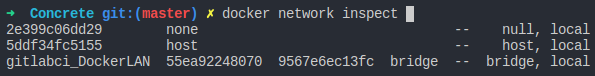

# Gitlab + CI = GitlabCI
## Um poderoso repositório de códigos e Continuous Integration

Todos nós da comunidade de desenvolvedores conhecemos várias plataformas de repositórios e Continuous Integration, cada uma com seus devidos destaques, e boa parte do mercado acaba selecionando uma plataforma para cada um deles (repositório e CI), fazendo com que haja um trabalho a mais para que a integração entre esses 2 estejam completas e bem refinadas para poderem ser utilizadas pelo seus times.

Mas porque não usar uma ferramenta que una esses 2 serviços? 

### Montando seu próprio Gitlab CI com Docker

Para criar nosso lab iremos utilizar a versão 9.5, a mais estável até o momento. Caso queira consultar mais infos sobre as versões do Gitlab, acesse o [repositório oficial](https://hub.docker.com/r/gitlab/gitlab-ce/) do Gitlab no DockerHub.

```
docker pull gitlab/gitlab-ce:10.1.4-ce.0
```

O download é um pouco demorado. Após a sua conclusão, inicie o download do runner do GitlabCI com o comando abaixo. Veja que iremos utilizar também a versão 9.5 do Runner, pois se formos utilizar uma versão diferente do Gitlab CE que baixamos, há grande chances de haver incompatibilidades.

```
gitlab/gitlab-runner:ubuntu-v10.1.0
```

Feito os 2 downloads, suba os 2 containers utilizando o Docker Compose para facilitar a tarefa. Caso tenha duvidas sobre o docker compose, sua instalação e utilização, [clique aqui](https://docs.docker.com/compose/install/).

```
version: '3'
services:
 Gitlab_CI:
  container_name: Gitlab_CI
  image: 'gitlab/gitlab-ce:10.1.4-ce.0'
  networks: 
   - 'DockerLAN'
  restart: always
  hostname: 'gitlab.machine'
  ports:
   - '80:80'
  volumes:
   - '/srv/gitlab/config:/etc/gitlab'
   - '/srv/gitlab/logs:/var/log/gitlab'
   - '/srv/gitlab/data:/var/opt/gitlab'
 Gitlab_Runner:
  container_name: Gitlab_Runner
  image: 'gitlab/gitlab-runner:v10.1.0'
  networks:
   - 'DockerLAN'
  restart: always
  volumes:
   - '/var/run/docker.sock:/var/run/docker.sock'
   - '/srv/gitlab-runner/config:/etc/gitlab-runner'
networks:
 DockerLAN:
  driver: bridge
```

Vamos ler cada passo do nosso compose:

*
*
*

Concluída a execução, você terá o retorno do compose como OK informando que os contâineres foram criados. Digite ```docker container ls``` e você verá que o contâiner do Gitlab Runner já está rodando e o do Gitlab CI está sendo iniciado ```(health: starting)```, como na imagem abaixo:


Aguarde mais alguns minutos para que todo serviço seja configurado e execute mais uma vez comando do ```ls``` para conferir se o status do contâiner está como ```(healthy)```. Logo em seguida temos de adicionar o gateway da network criada no compose em nossa maquina editando o arquivo ```/etc/hosts``` . Para conferir o gateway a ser adicionado execute o comando ```docker network inspect``` e selecione a network criada na execução do compose, no caso a que fizemos tem o nome ```DockerLAN```  final. Veja a imagem abaixo como exemplo:



Explicar a prática de "taggear" as imagens.

Colocar explicação de cada passo da execução acima.

Referencias:  
https://docs.gitlab.com/runner/install/docker.html  
https://docs.gitlab.com/runner/executors/README.html  
https://docs.gitlab.com/runner/register/index.html